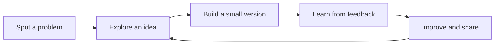

# Abhinav Kumar Mishra

 

 
Retro counter: profile views, not unique visitors.

---

## A little about me

I’m a computer science student learning software by building and improving real projects. I’m especially interested in practical mobile apps and technology that can help with everyday problems. Away from the keyboard, I’m usually listening to music or riding.

**Currently exploring:** Kotlin · TypeScript · mobile development · product thinking

## Things I’m building

<table>
  <tr>
    <td width="50%" valign="top">
      <h3>🌿 Soil Mates</h3>
      
An agri-tech app concept for farmers and agri-vendors, with crop disease support and practical farming resources.

      <a href="https://github.com/abhinav2404-hub/Soil-Mates">Explore the project →</a> 
      TypeScript
    </td>
    <td width="50%" valign="top">
      <h3>📱 SIH 2026</h3>
      
An Android app project from my Smart India Hackathon 2026 work. Visit the repository for the latest implementation details.

      <a href="https://github.com/abhinav2404-hub/SIH-2026">Explore the project →</a> 
      Kotlin
    </td>
  </tr>
</table>

## My build loop

## Find me on GitHub

- Browse my [repositories](https://github.com/abhinav2404-hub?tab=repositories).
- Have a question or suggestion? Open an issue on the related project.

---

*Still figuring out software, one project at a time.*

