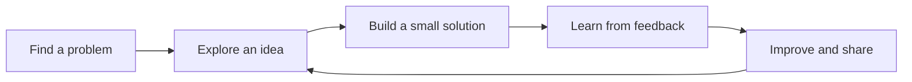

# Hi, I’m Abhinav Kumar Mishra 👋

### CSE student · Learning software by building projects · Music & bikes off-screen 🎧🏍️

---

## About me

I’m a computer science student exploring software development one project at a time. I like turning ideas into useful apps, learning by experimenting, and improving with each build. When I’m away from the keyboard, I’m probably listening to music or out riding.

- 🌱 Learning by building with **Kotlin** and **TypeScript**
- 🧪 Interested in practical apps, mobile development, and ideas that solve everyday problems
- 🚀 I value curiosity, steady progress, and sharing what I make

## Featured projects

| Project | What it is | Built with |
| --- | --- | --- |
| [🌿 Soil Mates](https://github.com/abhinav2404-hub/Soil-Mates) | An agri-tech app concept for farmers and agri-vendors, with crop disease support and practical farming resources. | TypeScript |
| [📱 SIH 2026](https://github.com/abhinav2404-hub/SIH-2026) | An Android app project from my Smart India Hackathon 2026 work; the repository has the current implementation details. | Kotlin |

## How I work

## Tech I’m exploring

  
  
  

## Find me

- GitHub: [@abhinav2404-hub](https://github.com/abhinav2404-hub)
- Have a question about one of my projects? Open an issue in its repository.

---

*Still figuring out software, one project at a time.*

