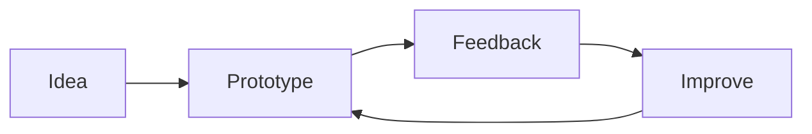

# Project card profile template

# Abhinav Kumar Mishra 👋

Computer science student building practical apps and learning as I go.

<table>
  <tr>
    <td width="50%" valign="top">
      <h3>🌿 Soil Mates</h3>
      
An agri-tech app concept for farmers and agri-vendors.

      
<b>Stack:</b> TypeScript

      <a href="https://github.com/abhinav2404-hub/Soil-Mates">View project →</a>
    </td>
    <td width="50%" valign="top">
      <h3>📱 SIH 2026</h3>
      
An Android app project from my Smart India Hackathon work.

      
<b>Stack:</b> Kotlin

      <a href="https://github.com/abhinav2404-hub/SIH-2026">View project →</a>
    </td>
  </tr>
</table>

## What I’m learning

`Kotlin` · `TypeScript` · `Mobile development`

## My approach

  
   Counts profile views, not unique visitors.

